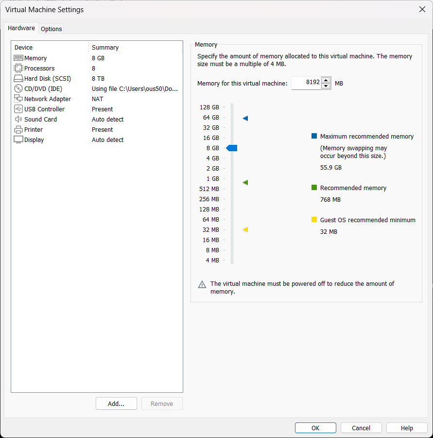
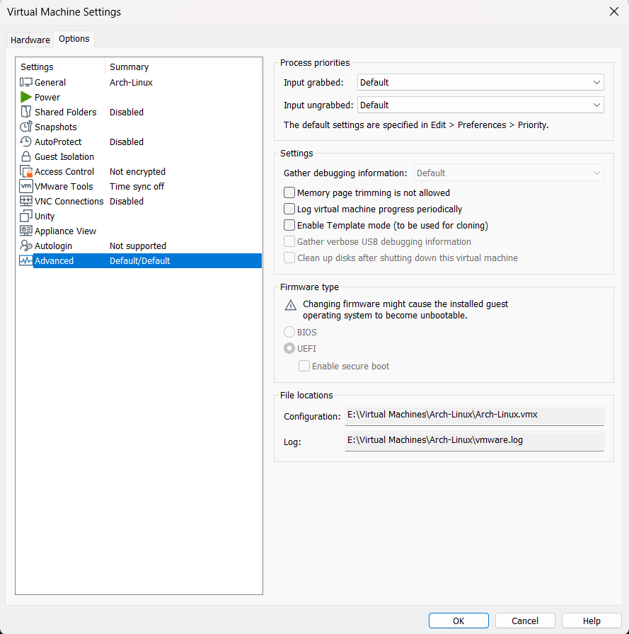

## Before installation

Create a virtual machine and adjust depend config on your need(Except for the UEFI firmware part):







To prevent the creation of vmem files for acceleration, [add the following lines to your .vmx file][1](:

```
prefvmx.minVmMemPct = "100"
MemTrimRate = "0"
mainMem.useNamedFile = "FALSE"
sched.mem.pshare.enable = "FALSE"
prefvmx.useRecommendedLockedMemSize = "TRUE"
```


Boot up the vm, and check if the firmware is UEFI or not:

```bash
ls /sys/firmware/efi/efivars
```

if it's legacy BIOS, it will returns `No such file or directory.`


## Partitioning

Create a [new GPT partition table and partitioned with an EFI Partition no less than 300MiB][2] and an Linux partition with `cgdisk` or any other partition tools you want to use:

```bash
cgdisk /dev/sda
```


### Format partitions

#### EFI

```bash
mkfs.fat -F32 /dev/sda1
```

#### Root system

```bash
mkfs.btrfs -f -L Arch /dev/sda2
```


#### Building BTRFS subvolume

- `@`：corresponding to  `/`
- `@home`：corresponding to`/home`
- `@cache`：corresponding to   `/var/cache`
- `@docker`：corresponding to `/var/lib/docker`
- `@log`：corresponding to  `/var/log`

Enabling COW in `@cache, @log` is not needed.

1. Mount root partition to `/mnt`:

```bash
mount -t btrfs -o compress=lzo /dev/sda2 /mnt
```

> Generally we lzo is good enough. Reports shows that btrfs is way slower even under Zstd:1, while lzo has nearly no difference compared with non-compressed.

2. Create subvolumes:

```bash
btrfs subvol create /mnt/@
btrfs subvol create /mnt/@home
btrfs subvol create /mnt/@cache
btrfs subvol create /mnt/@docker
btrfs subvol create /mnt/@log
btrfs subvol create /mnt/@tmp
btrfs subvol create /mnt/@swap
# Use chattr to disable COW 
chattr +C /mnt/@cache
chattr +C /mnt/@log
chattr +C /mnt/@swap
# Umount the partition
umount /mnt
```


#### Mount partitions and subvolumes

```bash
mount -o noatime,nodiratime,ssd,compress=lzo,subvol=@ /dev/sda2 /mnt
mkdir -p /mnt/{boot/efi,home,var/{log,lib/docker,cache},tmp,swap}
mount -o noatime,nodiratime,ssd,compress=lzo,subvol=@home /dev/sda2 /mnt/home
mount -o noatime,nodiratime,ssd,compress=lzo,subvol=@log /dev/sda2 /mnt/var/log
mount -o noatime,nodiratime,ssd,compress=lzo,subvol=@docker /dev/sda2 /mnt/var/lib/docker
mount -o noatime,nodiratime,ssd,compress=lzo,subvol=@cache /dev/sda2 /mnt/var/cache
mount -o noatime,nodiratime,ssd,compress=lzo,subvol=@tmp /dev/sda2 /mnt/tmp
mount -o noatime,nodiratime,ssd,compress=lzo,subvol=@swap /dev/sda2 /mnt/swap
```


#### Mount EFI partition:

```bash
mount /dev/sda1 /mnt/boot/EFI
```


### Install the system

```bash
pacstrap /mnt base base-devel linux linux-firmware btrfs-progs networkmanager dhcpcd iwd vim sudo zsh zsh-completions {intel,amd}-ucode net-tools linux-headers curl git wget 
```


### Generate fstab

```bash
genfstab -U /mnt > /mnt/etc/fstab
```

Check again carefully after generation. Then proceed to post installation.


## Post Installation

```bash
arch-chroot /mnt	
```


### Set mirror for pacman

Use reflector or just update `/etc/pacman.d/mirrorlist`, then apply changes via `pacman -Syy`.


### Install bootloader

 In this article we use grub as the bootloader, since it is one of a few bootloaders has a good support to btrfs.

```bash
pacman -S grub efibootmgr os-prober
```


```bash
grub-install --target=x86_64-efi --efi-directory=/boot/efi --bootloader-id=Arch
```

successful results is shown below.


Then do some optimization.  Increase the log level and add `nowatchdog` param to accelerate the speed of booting and powering off:

```bash
nano /etc/default/grub
```

 and edit as below:

```diff
- GRUB_CMDLINE_LINUX_DEFAULT= "loglevel=5"
+ GRUB_CMDLINE_LINUX_DEFAULT= "loglevel=5 nowatchdog"
```

Save it and then generate new grub config file to apply changes.

```bash
[root@archiso /] # grub—mkconfig —o /boot/grub/grub.cfg
Generating grub configuration file ...
Found linux image: /boot/vmlinuz-linux
Found initrd image: /boot/intel—ucode.img /bootzamd—ucode.img /boot/initramfs—linux.img
Found fal Iback initrd image(s) in /boot :
intel—ucode.img amd—ucode.img initramfs—linux—fallback.img
Warning: os—prober will not be executed to detect other bootable partitions.
Systems on them will not be added to the GRUB boot configuration.
Check documentation entry.
Adding boot menu entry for UEFI Firmware Settings ...
done
```


### Set hostname and hosts

```bash
newHostname="Your-new-hostname"
echo $newHostname > /etc/hostname
echo -e "127.0.0.1   localhost\n" "::1         localhost\n" "127.0.1.1   $newHostname.localdomain $newHostname" >> /etc/hosts
```


### Set Timezone

```bash
ln -sf /usr/share/zoneinfo/Asia/Hong_Kong /etc/localtime
```

### 

### Set locale

```bash
nano /etc/locale.gen
```

and uncomment `en-US.UTF-8 UTF-8` and any locale you wanna to use, then generate locale and set en_US locale:

```bash
locale-gen && echo 'LANG=en_US.UTF-8'  > /etc/locale.conf
```


### Setting up user accounts

First set the root account password:

```bash
passwd root	
```


```bash
yourName="example"
useradd -m $yourName && echo "Set a new password for the user $yourName" && passwd $yourName
```


### Desktop Environment

In this article we install [KDE](https://wiki.archlinux.org/title/KDE):

```
pacman -S plasma plasma-wayland-session egl-wayland kde-{accessibility,graphics,multimedia,network,pim,sdk,system,utilities}-meta
```


### VMware Tools

Arch Linux is not supported in the official VMware Tools. OpenVMTools is commonly used. 

Using Open VM Tools one cannot resize the screeen properly. Here's a solution following to a [reddit post][3]:

```shell
sudo pacman -Syu
sudo pacman -S open-vm-tools
sudo pacman -Su xf86-input-vmmouse xf86-video-vmware mesa gtk2 gtkmm
echo needs_root_rights=yes | sudo tee /etc/X11/Xwrapper.config
sudo systemctl enable --now vmtoolsd
```

And you are good to go.


Reference:

[1]: https://gist.github.com/extremecoders-re/cf8d829c108d58bfbb2e3c1f4121d7e1 "Disabling vmem files creation."

[2]: https://wiki.archlinux.org/title/Installation_guide#Example_layouts	"Partition layout "
[3]: https://www.reddit.com/r/archlinux/comments/b0ona0/vmtools_on_arch_linux_full_screen_or_resizing/	"vmware tools how-to"

https://blog.zrlab.org/posts/arch-btrfs

https://wiki.archwiki.org

https://ericclose.github.io/Installing-Arch-as-a-guest-with-UEFI-and-GPT.html

https://arch.icekylin.online/rookie/basic-install.html

https://www.reddit.com/r/archlinux/comments/b0ona0/vmtools_on_arch_linux_full_screen_or_resizing/
